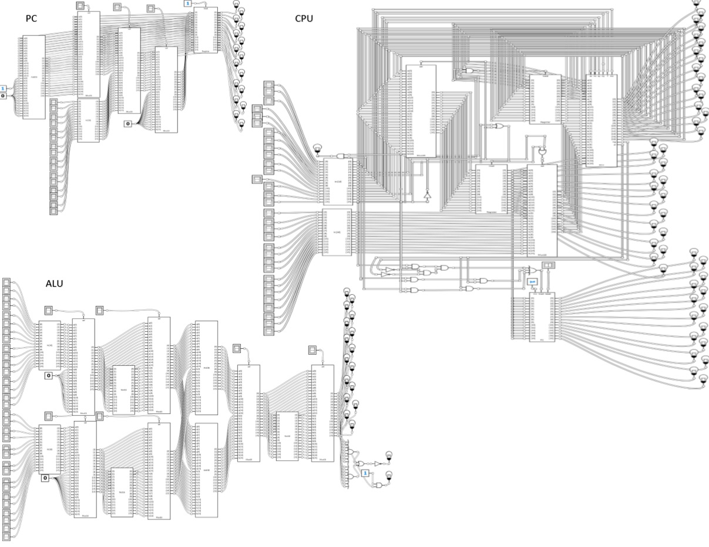
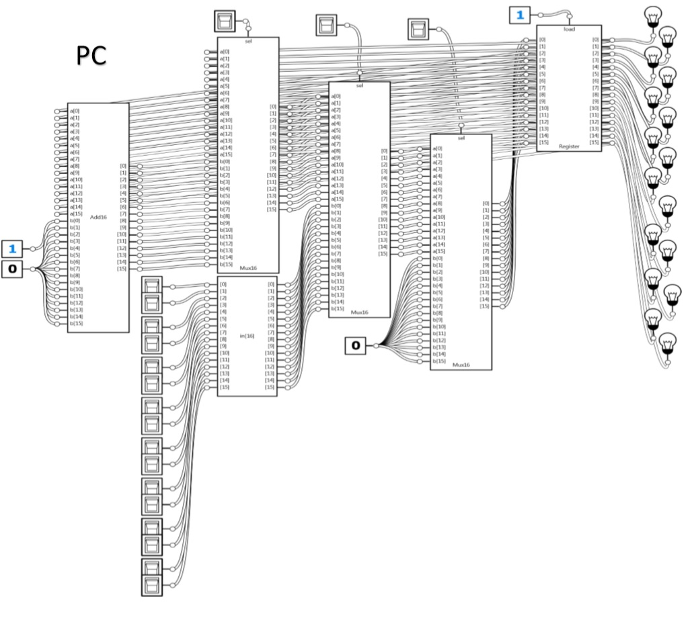
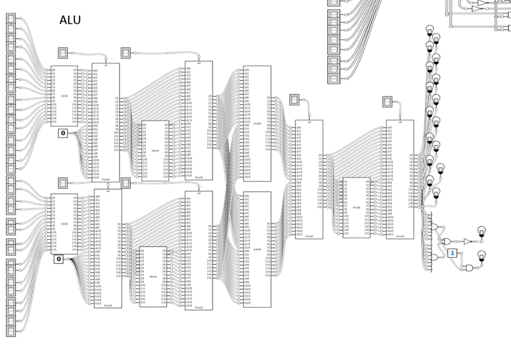
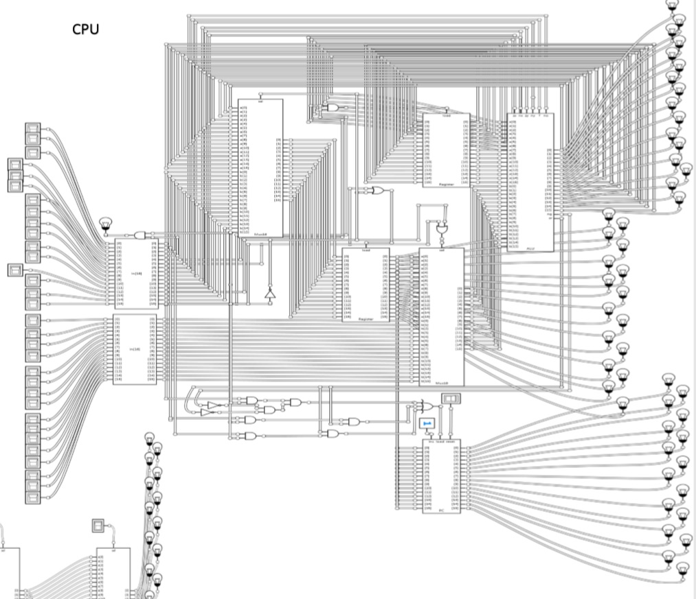
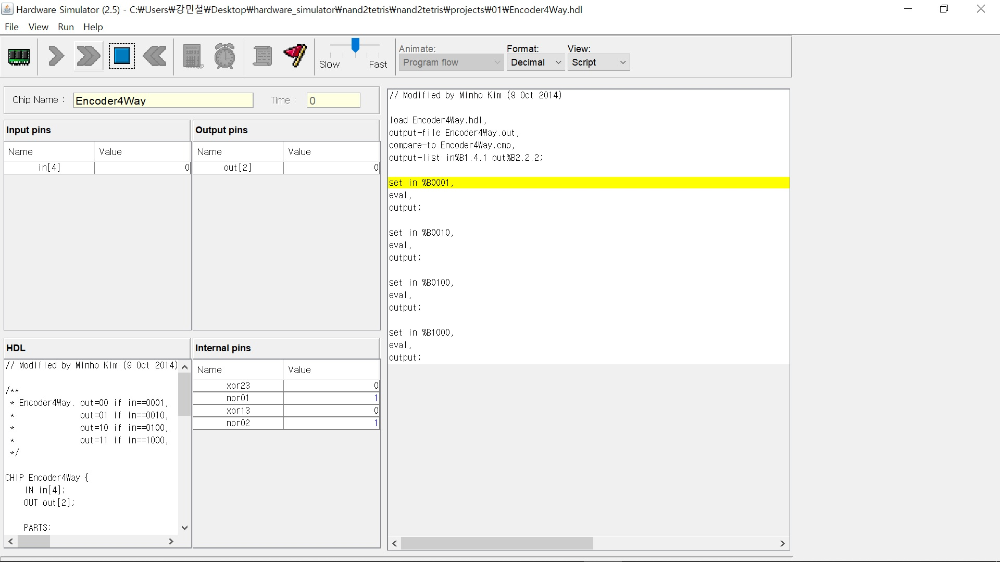
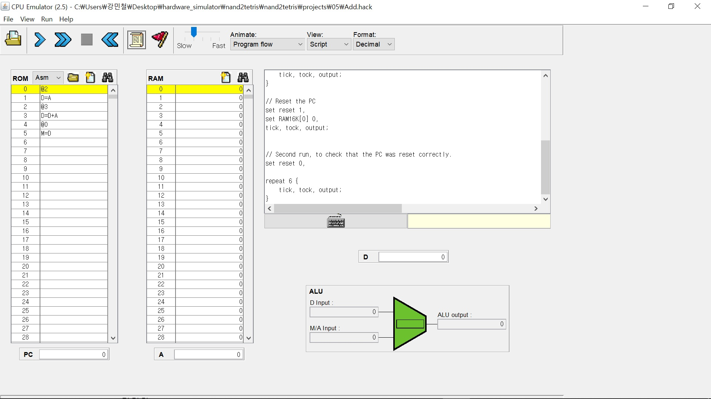

# Custom CPU 만들기

## 0. 개요

1. 프로젝트 소개
2. 사진
3. 기능
4. 한계 및 과제

-------------

## 1. 프로젝트 소개

아주아주 기본적인 NAND 게이트를 이용하여 
ALU와 RAM을 포함한 
Custom CPU를 만드는 소규모 프로젝트이다.

기본적인 코드는 hdl코드로 작성되었고,
어떤 파일이 필요한지, tst파일과 cmp 파일 등의 
프로젝트 파일 세팅은
nand2tetris.org에서 가지고 왔다.

또한 Multi-Logic Gate의 아웃라인의 일부는 
시립대학교 김민호 교수님의 자료를 이용했다.

Complete CPU를 구현할 적에는 모든 부품을
NAND에서부터 Bottom-Up Approach 하기엔 속도 면에서  무리가 있다고 판단하고, Built-in Chip들을 사용하였다.

물론 tst와 cmp 파일 아웃라인만 가지고 오고,
hdl 코드는 모두 본인이 직접 작성하였다. (그래서 그다지 효율적이지 않을 수 있다..)

코드의 검증은
hardware simulator
CPU Emulator를 이용하였다.

이 두개의 툴도 nand2tetris에서 제공한다.

또한 학교 수업 과제의 일부로 7 Segment Display도 구현해 보았다. 

해당 내용은  **7SegmentDisplay.pdf** 를 보면 알 수 있지만 단순무식하게 구현했기 때문에 누구 보여주기 쫌 그렇긴 하다..

## 2. 사진 

우선 완성된 설계 도면은 다음과 같다.

## 기능 

Multi Way Gate 까지는 HardWare Simulator로 확인해볼 수 있다. 

#### 예시) Encoder4Way테스트 

그 이후 CPU 동작 과정은 CPU Emulator로 작동확인을 하였다. 

## 한계 및 과제 

**당연히 상용화하지 못한다.**

이 프로젝트는 어딘가에 내세우기 위함이 아니라 
"정말 CPU를 비롯한 모든 컴퓨터가 AND, OR, NOT 만으로 만들어질까?"

"정말 NAND gate 하나 만으로 모든 부품이 만들어질까?"

를 눈으로 확인해보기 위해 만든 일종의 습작과도 같은 것이다.  (물론 학교 [디지털논리회로] 강의를 좀 더 능동적으로 듣고 싶기도 했다..)

다만, 이러한 Bottom-Up Approach 도 정말 재미있었다.

앞으로 이런 류의 프로젝트를 또 진행할 것 같은데,
다음은 아마도 **"정말 쓸 수 있는 운영체제 만들기"**
**"정말 쓸 수 있는 CPU 만들기"** 가 될 것 같다.

운영체제 만들기는 논외로 치더라도, 다음에 CPU를 다시 설계해본다면, 
그 땐 이번 프로젝트처럼 처음부터 모든 걸 만들진 않을 것 같다. 효율성이 떨어지고, 행여나 실수가 있을 수도 있기 때문이다. 
때문에 최대한 많은 Built-in Chip과 테스트 도구를 이용할 것 같다.
